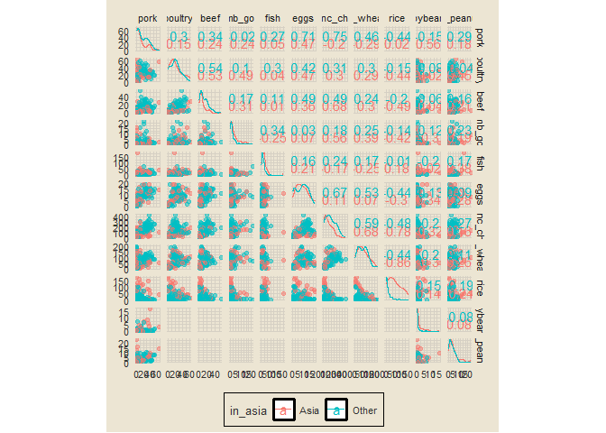

hyperparameter tuning with tidymodels
================

### setup

``` r
library(tidyverse)
library(tidymodels)
library(janitor)
library(tvthemes)
library(countrycode)
library(GGally)
options(scipen = 999)

theme_custom = theme_avatar() +
  theme(plot.title = element_text(hjust = 0.5),
        panel.grid.major = element_line(linewidth = 0.5, colour = "#D6D0C4"),
        panel.grid.minor = element_line(linewidth = 0.5, colour = "#D6D0C4"))

theme_set(theme_custom)
```

### data import

``` r
link = "https://raw.githubusercontent.com/rfordatascience/tidytuesday/master/data/2020/2020-02-18/food_consumption.csv"
food_consumption = read_csv(link, col_types = cols())
glimpse(food_consumption)
```

    ## Rows: 1,430
    ## Columns: 4
    ## $ country       <chr> "Argentina", "Argentina", "Argentina", "Argentina", "Arg~
    ## $ food_category <chr> "Pork", "Poultry", "Beef", "Lamb & Goat", "Fish", "Eggs"~
    ## $ consumption   <dbl> 10.51, 38.66, 55.48, 1.56, 4.36, 11.39, 195.08, 103.11, ~
    ## $ co2_emmission <dbl> 37.20, 41.53, 1712.00, 54.63, 6.96, 10.46, 277.87, 19.66~

### adding `continent` variable

``` r
food_consumption = food_consumption |>
  mutate(continent = countrycode(country, origin = "country.name", destination = "continent"))

food_consumption |>
  count(continent) |>
  ggplot(aes(reorder(continent, -n), n)) +
  geom_col(aes(fill = continent), show.legend = F) +
  geom_text(aes(label = n), size = 3.5, vjust = -0.5) +
  labs(x = NULL, y = "count", title = "continent counts") +
  theme(axis.text.y = element_blank())
```

<!-- -->

### reformatting data + adding `in_asia` variable

``` r
food = food_consumption |>
  select(-co2_emmission) |>
  pivot_wider(names_from = "food_category", values_from = "consumption") |>
  clean_names() |>
  mutate(in_asia = ifelse(continent == "Asia", "Asia", "Other")) |>
  select(-country, -continent) |>
  mutate_if(is.character, factor)

sample_n(food, 10)
```

    ## # A tibble: 10 x 12
    ##     pork poultry  beef lamb_goat  fish  eggs milk_inc_c~1 wheat~2   rice soybe~3
    ##    <dbl>   <dbl> <dbl>     <dbl> <dbl> <dbl>        <dbl>   <dbl>  <dbl>   <dbl>
    ##  1 19.8    20.2   6.39      1.24  4.76  9.82        99.9     54.6  67.7     6.34
    ##  2 48.9    28.6  12.2       2.16 28.8  13.3        164.      93.9   8.32    0.02
    ##  3 36.4    23.9  17.7       0.94 18.6  14.0        341.      70.2   2.93    0.12
    ##  4  1.36    8.63  1.09      1.74 26.0   1.21         9.08    14.4  32.0     0.01
    ##  5  0.29    0.47  9.54      1.86  4.27  1.84        94.9     34.6  12.9     0.2 
    ##  6 24.1    46.1  33.9       9.87 17.7   8.51       234.      70.5  11.0     0.19
    ##  7 12.6    45    39.2       0.62 10.0   8.98       149.      53    32.1     3.62
    ##  8  7.23   39.3  25.9       0.32  8.34  5.63       118.      49.2  23.4     0   
    ##  9  0.16    1.83  6.26      1.6   9.18  1.95        20.6     18.6  97.1     0   
    ## 10  0       1.4   1.28      1.33 18.1   2.08        21.9     17.5 172.      0.61
    ## # ... with 2 more variables: nuts_inc_peanut_butter <dbl>, in_asia <fct>, and
    ## #   abbreviated variable names 1: milk_inc_cheese, 2: wheat_and_wheat_products,
    ## #   3: soybeans

### using `ggscatmat` to produce pairwise plots

``` r
food |>
  ggscatmat(columns = 1:11, color = "in_asia", alpha = 0.5)
```

<!-- -->

### creating bootstrap data

``` r
set.seed(1234)
food_boot = bootstraps(food, times = 30)
food_boot
```

    ## # Bootstrap sampling 
    ## # A tibble: 30 x 2
    ##    splits           id         
    ##    <list>           <chr>      
    ##  1 <split [130/48]> Bootstrap01
    ##  2 <split [130/49]> Bootstrap02
    ##  3 <split [130/49]> Bootstrap03
    ##  4 <split [130/51]> Bootstrap04
    ##  5 <split [130/47]> Bootstrap05
    ##  6 <split [130/51]> Bootstrap06
    ##  7 <split [130/57]> Bootstrap07
    ##  8 <split [130/51]> Bootstrap08
    ##  9 <split [130/44]> Bootstrap09
    ## 10 <split [130/53]> Bootstrap10
    ## # ... with 20 more rows

### building model specification

``` r
rf_spec = rand_forest(mode = "classification", trees = 1000,
            mtry = tune(), min_n = tune()) |>
  set_engine("ranger")

rf_spec
```

    ## Random Forest Model Specification (classification)
    ## 
    ## Main Arguments:
    ##   mtry = tune()
    ##   trees = 1000
    ##   min_n = tune()
    ## 
    ## Computational engine: ranger

### model tuning

``` r
doParallel::registerDoParallel()
rf_grid = tune_grid(rf_spec, in_asia ~ ., food_boot)
```

    ## i Creating pre-processing data to finalize unknown parameter: mtry

``` r
rf_grid
```

    ## # Tuning results
    ## # Bootstrap sampling 
    ## # A tibble: 30 x 4
    ##    splits           id          .metrics          .notes          
    ##    <list>           <chr>       <list>            <list>          
    ##  1 <split [130/48]> Bootstrap01 <tibble [20 x 6]> <tibble [0 x 1]>
    ##  2 <split [130/49]> Bootstrap02 <tibble [20 x 6]> <tibble [0 x 1]>
    ##  3 <split [130/49]> Bootstrap03 <tibble [20 x 6]> <tibble [0 x 1]>
    ##  4 <split [130/51]> Bootstrap04 <tibble [20 x 6]> <tibble [0 x 1]>
    ##  5 <split [130/47]> Bootstrap05 <tibble [20 x 6]> <tibble [0 x 1]>
    ##  6 <split [130/51]> Bootstrap06 <tibble [20 x 6]> <tibble [0 x 1]>
    ##  7 <split [130/57]> Bootstrap07 <tibble [20 x 6]> <tibble [0 x 1]>
    ##  8 <split [130/51]> Bootstrap08 <tibble [20 x 6]> <tibble [0 x 1]>
    ##  9 <split [130/44]> Bootstrap09 <tibble [20 x 6]> <tibble [0 x 1]>
    ## 10 <split [130/53]> Bootstrap10 <tibble [20 x 6]> <tibble [0 x 1]>
    ## # ... with 20 more rows

### viewing tuning results

``` r
collect_metrics(rf_grid)
```

    ## # A tibble: 20 x 8
    ##     mtry min_n .metric  .estimator  mean     n std_err .config              
    ##    <int> <int> <chr>    <chr>      <dbl> <int>   <dbl> <chr>                
    ##  1    11    15 accuracy binary     0.812    30 0.0113  Preprocessor1_Model01
    ##  2    11    15 roc_auc  binary     0.823    30 0.0106  Preprocessor1_Model01
    ##  3     4    33 accuracy binary     0.813    30 0.00910 Preprocessor1_Model02
    ##  4     4    33 roc_auc  binary     0.821    30 0.00995 Preprocessor1_Model02
    ##  5     5    31 accuracy binary     0.816    30 0.00837 Preprocessor1_Model03
    ##  6     5    31 roc_auc  binary     0.820    30 0.0103  Preprocessor1_Model03
    ##  7     4    37 accuracy binary     0.817    30 0.00863 Preprocessor1_Model04
    ##  8     4    37 roc_auc  binary     0.819    30 0.0105  Preprocessor1_Model04
    ##  9     6     9 accuracy binary     0.825    30 0.00908 Preprocessor1_Model05
    ## 10     6     9 roc_auc  binary     0.833    30 0.00922 Preprocessor1_Model05
    ## 11     2     4 accuracy binary     0.830    30 0.00816 Preprocessor1_Model06
    ## 12     2     4 roc_auc  binary     0.844    30 0.00975 Preprocessor1_Model06
    ## 13     2    12 accuracy binary     0.830    30 0.00774 Preprocessor1_Model07
    ## 14     2    12 roc_auc  binary     0.836    30 0.00916 Preprocessor1_Model07
    ## 15     7    21 accuracy binary     0.816    30 0.00911 Preprocessor1_Model08
    ## 16     7    21 roc_auc  binary     0.824    30 0.0102  Preprocessor1_Model08
    ## 17     8    18 accuracy binary     0.815    30 0.0102  Preprocessor1_Model09
    ## 18     8    18 roc_auc  binary     0.825    30 0.0102  Preprocessor1_Model09
    ## 19     9    26 accuracy binary     0.813    30 0.00961 Preprocessor1_Model10
    ## 20     9    26 roc_auc  binary     0.821    30 0.0108  Preprocessor1_Model10

### showing best performing models

``` r
show_best(rf_grid, "roc_auc", n = 5)
```

    ## # A tibble: 5 x 8
    ##    mtry min_n .metric .estimator  mean     n std_err .config              
    ##   <int> <int> <chr>   <chr>      <dbl> <int>   <dbl> <chr>                
    ## 1     2     4 roc_auc binary     0.844    30 0.00975 Preprocessor1_Model06
    ## 2     2    12 roc_auc binary     0.836    30 0.00916 Preprocessor1_Model07
    ## 3     6     9 roc_auc binary     0.833    30 0.00922 Preprocessor1_Model05
    ## 4     8    18 roc_auc binary     0.825    30 0.0102  Preprocessor1_Model09
    ## 5     7    21 roc_auc binary     0.824    30 0.0102  Preprocessor1_Model08
